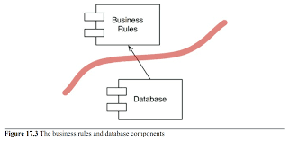

# Ch. 17 경계: 선 긋기
### 소프트웨어 아키텍처
- (경계)선을 긋는 기술
- 목적: 시스템을 만들고 유지하는 ***인적 자원***을 최소화 하는것.
--- 
## 17.1. Sad Story..
책에 나오는 케이스 요약본
### 17.1.1. P회사 케이스
- 데스크탑 GUI 모노리틱 제품.
- 웹버전으로 변환.
    - 3티어 아키텍처,서버 팜 분산, GUI / 미들웨어 / DB
    - 모든 도메인 객체가 각각 다른 머신에 3개씩 인스턴스를 가짐.
    - 레코드에 새로운 필드를 추가하려고 하면..
        - 많은 일을 해야됨(객체 초기화, 직렬, 마샬링, 파싱, 통신..)
- 서버팜 확보 실패
    - 단일 장비에서 해당 프로그램 실행.
        - 추가적인 작업이 불필요하게 많아짐

### 17.1.2. W회사 케이스
- SOA(서비스 지향 아키텍처)로 프로젝트를 구성.
- 객체들로 구성된 도메인 모델 생성.
- 레코드에 새로운 필드를 추가.
    - 할일이 많아짐.


**위 두케이스 모두 아키텍처를 도입했는데, 이른 결정으로 인해 오히려 인적 비용이 더 증가해버린 케이스를 말하고있다.**
- 이러지 말자!

## 17.2. 성공 사례 (FitNesse)
- 상위 원칙: "다운로드 후 바로 실행"
- 초기 결정:
    - 웹서버 직접 구현.
        - 웹 프레임워크에 대한 결정을 연기
    - DB에 대한 결정을 미루자.
    - 업무 규칙과 DB사이에 **"경계선"** 작성

**결과적으로 FitNesse는 굉장히 유연한 프로젝트가 됐다.**

## 17.3. 어떻게 선을 그을까? 그리고 언제 그을까?
- 관련이 있는 것과 없는 것 사이에 선을 긋는다.
    - GUI - 업무 규칙
    - DB - GUI
    - DB - 업무 규칙

### 17.3.1. 업무 규칙과 DB 선긋기
- DatabaseAccess를 보면, 해당 클래스를 알고있는 건 없다!


- 컴포넌트 단위로 한번 보자.
- DB는 BusinessRules 컴포넌트를 알고 있지만, 그반대는 아니다.
- 이러한 구조를 통해서 DB를 **선택사항**으로 남겨두고, 업무 규칙에 대한 개발을 우선적으로 할수 있다.



## 17.4. 입력과 출력은?
- **중요하지 않다는 사실!**

- "시스템의 행위가 입출력에 의한 행위다." 라고 생각하는 경향이 있다.
- 그래서 모델이 존재한다는걸 버린다.
- **중요한 사실은 모델은 사실 인터페이스(GUI)가 필요 없다는 사실이다..**


## 17.5. 플러그인 아키텍처
- GUI, DB가 플러그인의 형태를 띄게됨.
- 플러그인으로써의 컴포넌트의 교체가 좀더 용이해짐
- 물론 교체가 간단한 작업은 아닐거임.
- 결론적으로 플러그인 아키텍처를 통해서 업무 규칙외에 모든게 선택사항으로 취급할 수 있게 해줌.

### 17.5.1. GUI as Plugin
- 웹
- 클라이언트/서버
- SOA
- Console
- etc..

### 17.5.2. DB as Plugin
- SQL
- NoSQL
- FileSystem
- etc..

## 17.6. 플러그인에 대한논의
### 17.6.1. Resharper와 Visual Stuio의 관계
- Resharper: Visual Stuio 확장 플러그인
- Visual Studio와 Resharper는 철저히 비대칭 구조를 가진 관계
  - Resharper -> Visual Studio

### 17.6.2. 플러그인 아키텍처로 원하는 것
- 업무 규칙을 제외한 무언가를 변경하더라도, 우리 업무 규칙은 깨지지 않기를 바람.
- 경계는 변경의 축(axis of change)에 그어진다.
  - 변경의 축을 기반으로 컴포넌트의 개발 주기가 달라진다.
  - 같은 이유로 변경되는 애들끼리 묶여있으므로, SRP, CCP라고 할수 있다.


## Ch.17 결론
- 시스템을 컴포넌트 단위로 분리하고 경계선을 그어라.
- 핵심 업무 규칙 컴포넌트를 찾고, 나머지 컴포넌트는 플러그인으로써 역할을 시킨다.
- 컴포넌트가 특정 방향(핵심 업무 규칙 컴포넌트)으로 향하도록 한다.
- 선 긋기 및 플러그인 구조는 결국, DIP + SAP 의 응용이다.
  - 컴포넌트 결합 설명할때 SDP + SAP => 컴포넌트에 대한 DIP라고 했으니까, 결국 그냥 DIP에 대한 설명이라고 봐도 될것같다.


# Ch.18 경계 해부학
- `시스템 아키텍처 => 컴포넌트 + 경계선`
- 이번챕터는 경계선에 대한 다양한 형태 소개
## 18.1. 경계 횡단하기
- >**"_런타임에 경계를 횡단한다._"**
  - 경계의 한쪽에서 반대편 기능을 호출하는 것.
  - 적절하게 건너는 비결은 **소스코드 의존성 관리**에 있다.
  - 왜냐? -> 하나가 바뀌면 다 바뀌게 될지도 모르니까. => 프로그래머가 **"더"** 굴러야함
  - 경계는 이런 변경이 전파되는걸 막는 방화벽을 구축하고 관리하는 수단.

## 18.2. 두려운 단일체
- 물리적 구분이 없는 형태 (바이트코드상으로)
- **소스 수준 분리 모드** -> Ch.16.결합 분리 모드
- 배포관점에선 모노리스 파일 하나.
  - .exe
  - jar
  - c, c++ 컴파일 실행파일
- 개발 자체를 독립적으로 할수 있게 해주므로 좋다.

### 18.2.1. 일반적인 경계횡단
- Client(저수준)에서 Service(고수준)으로의 횡단.
- 런타임, 컴파일타임 의존성 모두 같은 방향으로 간다.

```kotlin
class Client(
  val service: Service
) {
    fun doSomething() {
        service.f(data) // val data : Data
    }
}
```
- 제어흐름: Client -> Service
- 의존성: Client -> service

### 18.2.2. 소스 수준 분리모드 경계횡단
- 동적 다형성을 사용하여 제어흐름을 바꾸면 (IOC) 의존성(컴파일타임)을 역전시킬 수 있다.

```kotlin
class Client(
  val service: Service
){
    
}

interface Service{
    fun f(data: Data)
}

data class Data(
  val x: Int
)
//---------------------------------------
class ServiceImpl: Service {
    override fun f(data: Data){
        //do work    
    }
}

```
- 제어흐름: Client -> Service -> ServiceImpl
- 경계선에서의 의존성: ServiceImpl -> Service
- 통신 => 단순한 함수 호출 => 빠르다

## 18.3. 배포형 컴포넌트
- 동적 링크 라이브러리를 사용해서 물리적인 경계 나뉨.
- 배포 수준 결합 분리 모드
- 배포과정만 빼면 단일체(모노리스)와 같다.
- 컴포넌트 의존성관리 => 동적 다형성 사용
- 통신 => 함수 호출 => 빠르다
- 동적 링크로 인한 런타임 로딩

## 18.4. 스레드
- 아키텍처 경계, 배포에 대한 건 아님
- 모든 스레드가 하나의 컴포넌트에 포함될 수 있고, 많은 컴포넌트에 걸쳐 분산 될수 있다.
- 왜 갑자기 스레드 설명을 하나싶은데, 
아마도 뒤에서 부턴 독립된 프로그램의 느낌으로 
설명되기 때문에 스레드를 중간에 둬서 모노리스와 배포형 컴포넌트
역시도 컴포넌트들을 독립적으로 배치시킬수 있다는걸 보여주고자 한거같다.

## 18.5. 로컬 프로세스
- 더 강력한 경계의 물리적 형태
- 로컬 프로세스 => 독립된 메모리 공간 사용
- os 기반 통신을 통해 **경계 횡단**이 일어난다.
- 의존성: 저수준 컴포넌트 -> 고수준 컴포넌트
- 통신: os기반 통신이라 이전 애들보단 느림

## 18.6. 서비스
- 더욱더 강력한 경계의 물리적 경계
- "**물리적 위치**"에 구애받지 않음
- 의존성: 저수준 서비스 -> 고수준 서비스
- 통신: 네트워크까지 들어가서 굉~~~장히 느려질수도?

### 정리
- 위 경계 기준은 절대적인 것도 아니며 단 하나만 적용되는 것도 아니다.
- 그래서 내가 봤을때 어떤 기준들이 있을지, 아키텍처에 대한 설명에서 나온것 기반(Ch.15)으로 한번 고려해야될 부분들을 정리해봤다.
  - 개발
  - 배포
  - 운영
  - 유지보수

| 비용   | 단일체(Monolith)                       | 배포수준     | 로컬 프로세스                          | 서비스                                             |
|------|-------------------------------------|----------|----------------------------------|-------------------------------------------------|
| 개발   | (프로젝트 규모, 팀규모)에 따라 개발 효율이 상이할거같다.   | ''       | ''                               | ''                                              | 
| 배포   | 모노리스 프로그램 하나(전체)가 배포됨               | 모듈별 배포   | 프로세스별 배포                         | 서비스 별 배포                                        |
| 운영HW | 단일 머신, 단일 프로세스로 (하드웨어)관리 및 확장성이 어려움 | 모노리스와 같음 | 각각 다른 프로세스이므로 메모리에 대한 최적화 가능 할듯. | 각각의 서비스를 머신별로 나눌수 있으므로 다양한 방식으로 HW를 최적화 시킬수 있음. |
| 유지보수 | 소스코드 수준 분리로 이슈 처리 간단해짐. (규모만 적당하다면) | 모노리스와 같음 | IPC가 추가됨에 따라 추가적으로 관리할게 늘어남.     | 각각의 머신에 대한 관리, 네트워크 통신 관리 등 관리대상은 훨씬 늘어남        | 
- 프로젝트, 팀, 회사의 규모가 커질수록 서비스 쪽으로 가야 관리가 편해질 것 같다.
- 반대로 작은 규모라면, 굳이 서비스 기준으로 나눌 필요까진 없지 않나 싶고.

## 결론.
- 단일체를 제외한 전략들은 여러가지를 선택할 수 있다.

---

# 질의응답

```text
지인:

대답: (PR에서 suggest로 커밋하기 편하게 질문 작성 후 이 구문은 지워주세요 ㅎㅎ)
```

```text
하진:

대답: (PR에서 suggest로 커밋하기 편하게 질문 작성 후 이 구문은 지워주세요 ㅎㅎ)
```

```text
규훤:

대답: (PR에서 suggest로 커밋하기 편하게 질문 작성 후 이 구문은 지워주세요 ㅎㅎ)
```

```text
진호:

대답: (PR에서 suggest로 커밋하기 편하게 질문 작성 후 이 구문은 지워주세요 ㅎㅎ)
```

```text
천규:

대답: (PR에서 suggest로 커밋하기 편하게 질문 작성 후 이 구문은 지워주세요 ㅎㅎ)
```

```text
준우: 저자가 이야기하는 고도로 추상화된 비즈니스 로직의 경계선 긋기는 너무 이상적인 경우에나 먹히는 이야기가 아닌가라는 생각이 듭니다. 
실제로 과연 세부사항이 업무규칙에 영향을 주는 경우는 정말로 없다고 말할 수 있을까요? 반례가 하나 정도는 있을 것 같은데 예시를 들어주시면 감사하겠습니다.

대답: (PR에서 suggest로 커밋하기 편하게 질문 작성 후 이 구문은 지워주세요 ㅎㅎ)
```

```text
이영:

대답: (PR에서 suggest로 커밋하기 편하게 질문 작성 후 이 구문은 지워주세요 ㅎㅎ)
```

```text
영재:

대답: (PR에서 suggest로 커밋하기 편하게 질문 작성 후 이 구문은 지워주세요 ㅎㅎ)
```

```text
가온:

대답: (PR에서 suggest로 커밋하기 편하게 질문 작성 후 이 구문은 지워주세요 ㅎㅎ)
```
