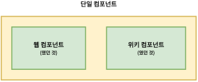

# 클린 아키텍처

## 아키텍처의 목적
<br/>

> *그것은 세부사항이 해야 할 일이다.*

<br/>

- **프레임워크로부터의 독립**

프레임워크의 제약사항을 시스템 전체에 강제하지 않는다.

- **용이한 테스트**

업무규칙은 독립적으로 테스트할 수 있어야 한다.

- **UI 독립성**

UI의 변경은 업무 규칙에 영향을 주지 않는다.

- **데이터베이스 독립성**

데이터베이스의 변경은 업무 규칙에 영향을 주지 않는다.

- **외부 세계와의 독립성**

외부 세계의 일은 업무 규칙에 영향을 주지 않는다.

<br/><br/>

<div align="center">
  
  <br/><br/>
  <p><em><b>소스 코드 의존성은 안쪽으로, 고수준의 정책을 향해야 한다.</b></em><p/>
  <p><em>꼭 원이 4개일 필요는 없다.</em><p/>
</div>

- **엔티티**

다양한 애플리케이션에서 재사용할 수 있는 핵심 업무 규칙

> *[이 어플리케이션들의 언어가 제각각 다르다면?](https://github.com/AlmSmartDoctor/clean-architecture-study/pull/50)*

[RPC<sub>Remote Procedure Call</sub>](https://medium.com/naver-cloud-platform/nbp-%EA%B8%B0%EC%88%A0-%EA%B2%BD%ED%97%98-%EC%8B%9C%EB%8C%80%EC%9D%98-%ED%9D%90%EB%A6%84-grpc-%EA%B9%8A%EA%B2%8C-%ED%8C%8C%EA%B3%A0%EB%93%A4%EA%B8%B0-1-39e97cb3460)가 하나의 해답이 될 수 있다.

RPC는 네트워크로 연결된 서버 상의 프로시저(함수, 메서드 등)를 원격으로 호출할 수 있는 기능이다. IDL<sub>Interface Definication Language</sub> 기반으로 다양한 언어를 가진 환경에서도 쉽게 확장이 가능하며, 인터페이스 협업에도 용이하다.

- **유스케이스**

애플리케이션에 특화된 업무 규칙

- **인터페이스 어댑터**

데이터를 유스케이스가 사용하는 형식에서 외부 에이전시가 사용하는 형식으로, 또는 그 반대로 변환한다.

MVC, MVVM 등의 디자인 패턴에서 Presenter, View Model, Controller 등을 포함한다.

[**리액트에서의 인터페이스 어댑터**](https://github.com/AlmSmartDoctor/clean-architecture-study/pull/48)

리액트의 경우, 많은 상태관리 라이브러리가 [Flux](https://facebook.github.io/flux/docs/in-depth-overview) 패턴을 사용한다. View에서 Model로의 직접적인 접근을 막는 ~~MVP~~MVVM 패턴에, 사용가능한 로직을 미리 정해놓은 Facade 패턴을 섞은 패턴이다.

Flux 패턴의 특징은 단방향 데이터 흐름이다. 데이터 조작 로직 호출은 View에서 Dispatcher로 흐르고, Dispatcher는Store(Model)에 접근하여 실제 데이터 조작을, Store은 변경된 데이터를 View로 보낸다.

- **프레임워크와 드라이버**

데이터베이스와 웹 프레임워크 등의 세부사항들


### 경계 횡단

<div align="center">
  
  <br/><br/>
  <p><em><b>제어 흐름이 고수준 정책을 향한다면 의존성을 역전해라.</b></em><p/>
</div>

<br/>

경계를 가로지르는 데이터 구조는 **데이터베이스의 데이터 구조를 그대로 사용하지 말라**.

우리는 내부의 원에서 외부의 원에 속하는 데이터베이스의 어느 것도 몰라야 한다.

### 전형적인 시나리오

<div align="center">
  
  <p><em><b>모든 의존성은 경계선을 안쪽으로 가로지른다.</b></em><p/>
</div>

이 다이어그램은 <b>ECB<sub>Entity-Control-Boundary</sub></b>와 <b>MVP<sub>Model-View-Presenter</sub></b>를 섞어 쓰는 것으로 보인다.

ECB에서 Boundary는 외부와의 상호작용을 캡슐화한다. ECB에서 Controller은 원래 유스케이스 계층에 속해 Boundary와 Entity를 중재하는 역할을 하지만, 여기에서는 Use Case Interactor가 이 Controller의 역할을 한다.

그림에서 [Boundary의 역할은 유스케이스 인터렉터와 컨트롤러를 양방향으로 분리하기 위한 인터페이스](https://github.com/AlmSmartDoctor/clean-architecture-study/pull/53/files)다. 후술할 **분리된 경계** 항목에서 에서 이렇게 분리하는 의도를 설명한다.

> *[Data Access Interface가 Entity에 직접 접근하는게 맞을까?](https://github.com/AlmSmartDoctor/clean-architecture-study/pull/49)*

~~이 인터페이스는 후술할 데이터베이스 Gateway에 해당한다. 그리고 이 Gateway는 유스케이스 계층과 데이터베이스 계층 사이, 즉 Presenter가 있는 인터페이스 어댑터 계층에 위치하는 것이 맞지 않을까.~~ 몰?루


# 프레젠터와 험블 객체

## 험블 객체 패턴

### 험블<sub>humble</sub> 객체

<div align="center">
 
 <br/>
</div>

- 대충 만든 객체 (from *『 xUnit Test Patterns 』*)

- 테스트하기 어려운 객체

- 보잘것 없는 객체

테스트하기 어려운 행위와 쉬운 행위를 두 개의 모듈, 또는 클래스로 나눈다. 이 중 **테스트하기 어려운 것**이 **험블 객체**이다.

[GUI에서 화면의 요소를 적절하게 표시하는 행위는 View가, GUI에서 수행하는 행위의 대다수는 Presenter가 맡는다. 따라서 View는 험블 객체이다.](https://github.com/AlmSmartDoctor/clean-architecture-study/pull/51)

Presenter는 유스케이스로부터 받은 데이터를 View Model이라는 데이터 구조에 담는다. View는 View Model에서 이 데이터를 찾아 화면에 로드할 뿐이다.

[**리액트에서의 험블 객체 패턴**](https://github.com/AlmSmartDoctor/clean-architecture-study/pull/52)

리액트에선 UI를 "컴포넌트(책의 앞장에서 언급됐던 컴포넌트보단 더 작은 단위)"로 구성한다.
함수형 컴포넌트에선 return 값이 실제로 렌더링되는 View이고, 데이터와 비즈니스 로직은 hook이라는 또다른 함수를 컴포넌트 안에서 호출해 사용할 수 있다.

```typescript
export function MyBox() {
  const { data, deleteData, insertData } = useData(); // hook

  return (
  <div>
    <input value={data} onChange={(e) => insertData(e.target.value)} />
    <button onClick={deleteData} />
  </div>
  )
}
```

로직들이 들어있어 테스트가 용이한 hook과, 테스트가 어려운 험블 객체인 View를 분리한 사례이다.

**험블 객체 패턴을 통해 테스트 용이성을 기준으로 모듈을 분리하면 저절로 아키텍처 경계가 정의된다.**

## 험블 객체 패턴의 예시

### 데이터베이스 게이트웨이

유스케이스와 데이터베이스 사이에는 데이터베이스 GateWay가 위치한다. Gateway는 어플리케이션이 데이터베이스에 수행하는 모든 메서드를 포함한다.

유스케이스 계층에선 데이터베이스 계층에서 구현한 Gateway 인터페이스를 호출한다. 이 구현체에선 직접 SQL을 사용하거나, 데이터베이스마다 다른 임의의 인터페이스를 통해 Gateway의 메서드에서 필요한 데이터에 접근하기 때문에 테스트가 *(유스케이스에 비해 비교적)* 어렵다. 따라서 **Gateway는 험블 객체**이다.

이와 달리 유스케이스 인터렉터에서는 호출하는 Gateway는 적당한 가짜 객체 또는 메서드로 교체할 수 있기 때문에 테스트가 용이하다.

### 데이터 매퍼

데이터 매퍼<sub>Data Mapper</sub>는 DB 테이블로부터 가져온 데이터를 데이터 구조에 맞게 담아준다. 이 또한 데이터베이스마다 다르기 때문에 데이터베이스 계층에 위치한다.

**데이터 매퍼 또한** 상기한 Gateway의 사례와 같이 유스케이스보다는 테스트가 어렵기 때문에 **험블 객체로 분류**한다.

### 서비스 리스너

애플리케이션이 외부 서비스와 통신 해야 한다면, 서비스와 가장 가깝게 맞닿아있는 **서비스 리스너<sub>Listener</sub>, 혹은 센더<sub>Sender</sub>가 험블 객체**이다.

# 부분적 경계

> *"그래, 어쩌면 필요할지도"*

아키텍처 경계를 완벽하게 만드는 데는 비용이 많이 든다. 하지만 나중에 필요할 수도 있으므로 경계에 필요한 공간을 확보하고 싶을 수 있다.

YAGNI<sub>You Aren't Goindg to Need it</sub> 원칙과 경계 모두를 지키고 싶을 때, 부분적 경계<sub>Partial Boundary</sub>를 구현해볼 수 있다.

### 마지막 단계를 건너뛰기

<div align="center">
  
  <br/>
</div>

분리된 컴포넌트를 만들기 위한 작업을 하고, 그대로 단일 컴포넌트에 모아만 둔다.

- **props**
  - 다수의 컴포넌트를 관리하는 작업이 필요 없다.
  - 추적을 위한 버전 번호도 없고, 배포 관리 부담도 없다.
  
- **cons**
  - 그래도 결국 하나의 컴포넌트 안에 있으므로, 원래 계획했던 분리된 컴포넌트 사이의 구분이 약화될 수 있다. 이는 의존성 방향이 엉킬 위험을 초래한다.
  
### 일차원 경계

<div align="center">
  
  <br/>
</div>

양방향으로 격리된 상태를 유지하기 위해 쌍방향 Boundary 인터페이스를 사용한다.

- **props**
  - 양방향으로 격리된 상태를 유지하면서 적은 비용으로 미래에 필요할지도 모르는 아키텍처 경계를 위한 공간을 마련할 수 있다.
  
- **cons**
  - 점선과 같이 비밀통로가 생겨 경계 분리가 붕괴될 수 있는 위험을 안는다.

### 퍼사드

<div align="center">
  
  <br/>
</div>

<b>퍼사드<sub>Facade: 정면, 앞면</sub></b>는 Client가 호출할 수 있는 모든 Service들을 메서드 형태로 제공한다.

Service 호출이 발생하면 해당 Service 클래스로 호출을 전달하므로, Client는 Service 클래스에 직접 접근할 수 없다.

- **props**
  - 매우 적은 비용으로 단순하게 경계를 구분지을 수 있다.
  
- **cons**
  - Client가 Service에 대해 추이 종속성을 가진다.

---

# 질의응답

```text
지인: 224p 험블 객체 패턴에서 테스트 하기 어려운 행위를 모두 험블 객체로 옮긴다고 합니다.
그렇게 나눠진 험블 객체에 뷰가 있고 이는 곧 프론트엔드라고도 볼 수 있을것 같아요.
프론트엔드가 테스트가 힘든건 맞지만 테스트가 안되는 건 또 아닌데... 험블 객체의 기준이
얼마나 엄격해야할지 궁금하네요.

대답: 
```

```text
하진:

대답: (PR에서 suggest로 커밋하기 편하게 질문 작성 후 이 구문은 지워주세요 ㅎㅎ)
```

```text
진영:

대답: (PR에서 suggest로 커밋하기 편하게 질문 작성 후 이 구문은 지워주세요 ㅎㅎ)
```

```text
규훤:
이번 질문은 지난 시간에 얘기했던 부분과 이어지는 내용일 수 있을 것 같네요.

216p에서 엔티티에 대한 설명 중에 `다양한 애플리케이션에서 엔티티를 재사용한다`라는 문구가 있는데,
이 말을 `전사적으로 이 엔티티 레이어를 공유한다`라고 받아들여도 될까요?

만약 그렇게 된다면, 서로 다른 언어의 애플리케이션에서는 어떤 방식으로 공유되어야 할까요?

대답: 
```

```text
천규:
22장에서 인터페이스 어댑터에 관한 이야기를 하면서 프레젠터와 컨트롤러가 언급되었는데,
이 둘의 구체적인 차이가 무엇인지 설명해 주실 수 있을까요?

저는 지금 모바일 파트에서 Model-View-ViewModel 패턴을 배우고 있는데,
그 전에 MVC나 MVP 패턴은 직접 써본 적이 없어서 잘 모르겠습니다.
혹시 웹 쪽에서 사용하고 계시는 패턴이 있다면 예시를 들어보고 싶네요.

대답: 
```

```text
준우: 220p의 그림 22.2 다이어그램을 보면 엔티티는 인터페이스에 직접 연결이 되는데, 

중간의 유스케이스(또는 그러한 역할을 하는 무언가의) 계층을 지나지 않고 곧바로 의존되는 형태가 과연 올바른지 궁금하네요. 

217p의 인터페이스 어댑터 부분의 말과 모순되는 것 같기도 합니다.

대답: (PR에서 suggest로 커밋하기 편하게 질문 작성 후 이 구문은 지워주세요 ㅎㅎ)
```

```text
이영:

대답: (PR에서 suggest로 커밋하기 편하게 질문 작성 후 이 구문은 지워주세요 ㅎㅎ)
```

```text
영재:

대답: (PR에서 suggest로 커밋하기 편하게 질문 작성 후 이 구문은 지워주세요 ㅎㅎ)
```

```text
가온:

대답: (PR에서 suggest로 커밋하기 편하게 질문 작성 후 이 구문은 지워주세요 ㅎㅎ)
```
