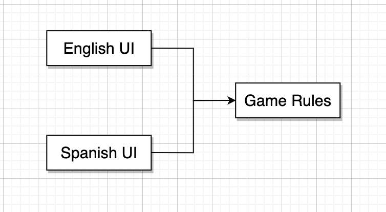
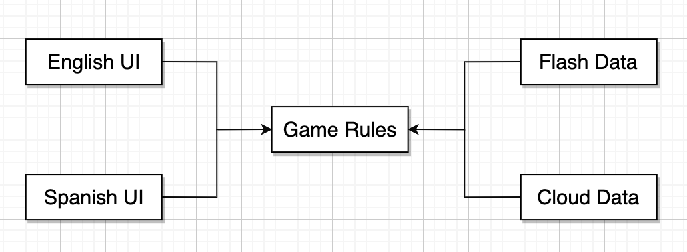
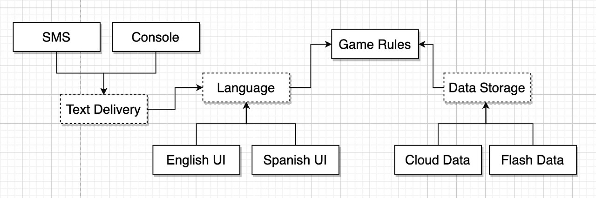
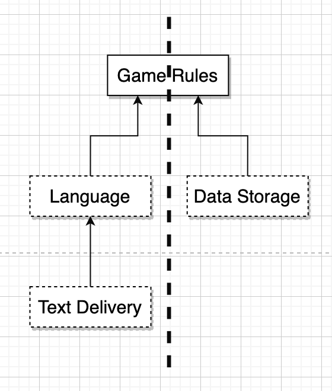
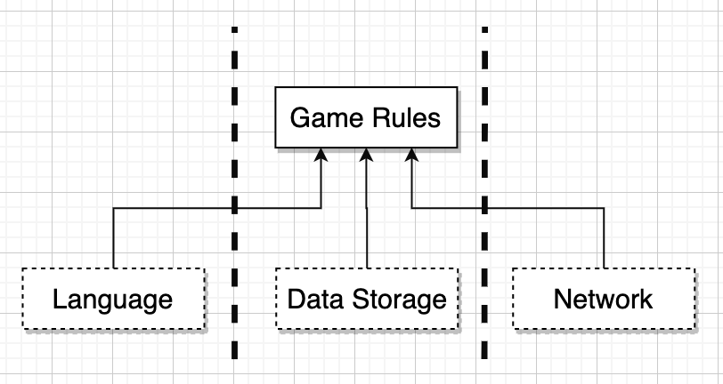
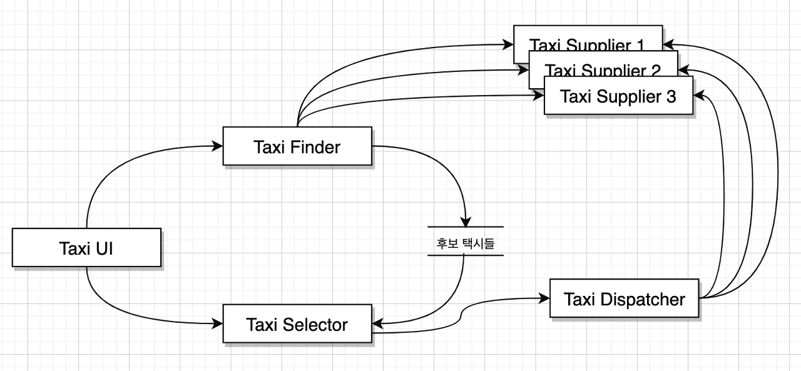
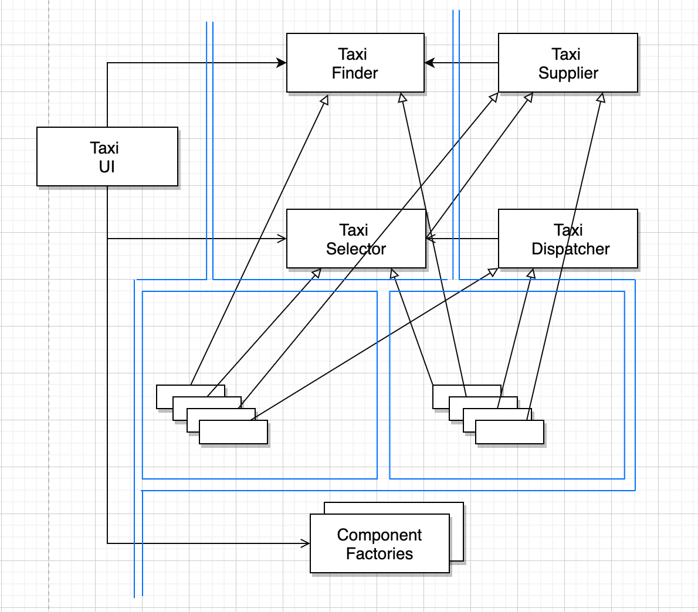
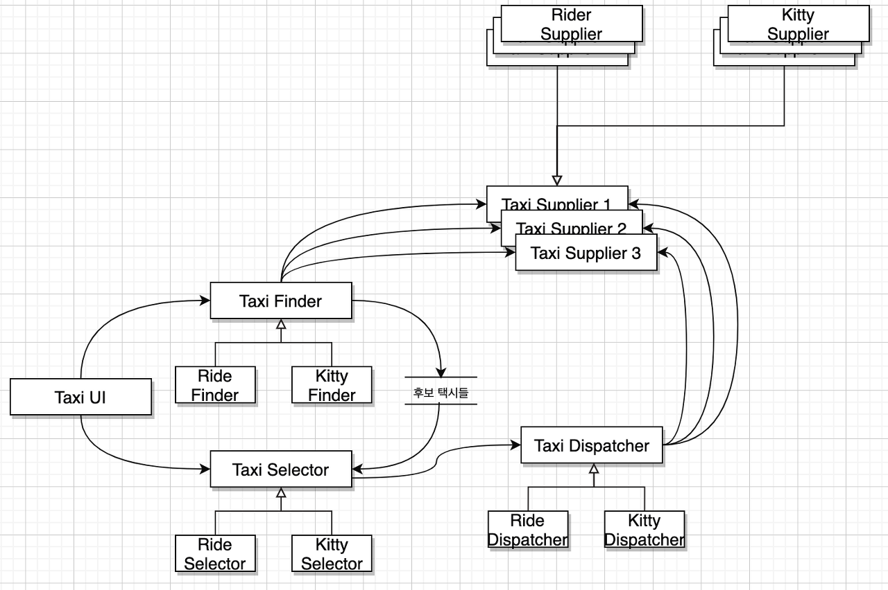
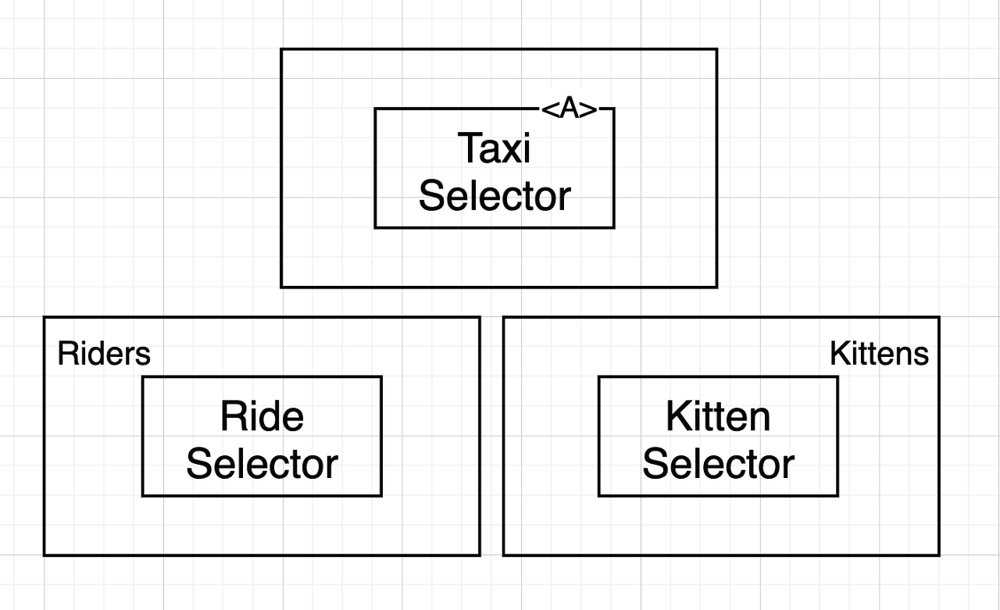

# 진행 자료

# 계층과 경계.

기본적인 컴포넌트만으로(GUI, 업무규칙, DB) 충분할까? => **아님!!**


## Wumpus Game
- 명령어 기반 텍스트 UI 게임


### 다양한 시장을 위한 UI분리

- 이런 경우에 UI자체가 컴포넌트로 분리되고 **언어** 라는 특성이 경계를 분리하기 위한 변경의 축이 된다.
- 의존성 관리가 잘된다면, 해당 추가사항은 중요한 로직, 실제 게임의 룰은 영향을 받지 않는다.
- 최종적으로는 UI뿐만 아니라 데이터 저장소 역시 저장소 종류라는게 변경의 축이 되고 해당, 의존성에 대한 관리를 한다면, 게임의 룰에 영향이 없다.
  


### 이런 분리가 충분할까?

- UI의 변경의 축은 언어만 있을까?
    - 텍스트를 주고받는 방식이 될수도 있다
    - Text Delivery, Language, DataStore를 추상 컴포넌트로 만듬으로써, Language라는 특성을 TextDelivery로 부터 격리 시킨다.(231p.일차원 경계)
    - Boundary 인터페이스는 상위 컴포넌트에 위치하고 하위 컴포넌트에서 구현해준다. (그림 25.4참조)
    - 이런 API컴포넌트(다형적 인터페이스)는 여러 구현체들로 존재할수 있게 된다.
    - LSP법칙을 지킨다면(p.82), API 컴포넌트를 구현체 컴포넌트로 교체하더라고, 행위는 변하지 않을것이므로, 그로 인해 아키텍처자체를 다형적으로 만들수 있을것이다.
      

### 데이터 흐름
- [User] -> TextDelivery -> Language -> GameRules -> DataStorage
- GameRules -> Language -> TextDelivery -> [User]

### 흐름 횡단(Crossing)
- 횡단이 저렇게 단순한 두가지만 존재할까?
    - Network를 추가해 멀티플레이를 지원하게 된다면,
    - "Network"라는 새로운 컴포넌트가 필요해진다.
    - 데이터 흐름은
        - 이전거 외에도
        - GameRule -> Network라는 새로운 흐름이 추가될것.
          

### 흐름 분리
- 흐름은 최상단 컴포넌트에서 만나게 될까?
    - 최상단 컴포넌트 자체가 분리될지도 모른다!
        - 플레이어상태(게임상태)
        - 맵, 오브제, 게임 이벤트 처리
        - 만약, MMO 게임이라면? -> 이런 최상단 컴포넌트에 대한 처리를 나눠서 처리하게 한다면,(PlayerManagement - 서버/ MoveManagement - user PC)
        - 분리가 될수 밖에 없음.


> _**이런 경계 분리가 꼭 모두 예측해서 할 필요도 없고, 그래선 안된다.
> 필요하다고 인지되는 경우에 분리를 해야한다.**_

# 메인 컴포넌트
- 책에서 DIP설명하는 부분에서 최초로 언급되고, (p.95)
- 이때 우리는 DIP를 위배하는 클래스(컴포넌트)라고 인지를 하고 있을 겁니다.
- 이 개념을 기반으로 좀더 자세히 알아보는 챕터.

### 궁극적인 세부사항.
- 책에서는 궁극적인 세부사항(가장 낮은 수준 정책)으로 표현하는데, 그이유로는
    - Factory, Strategy패턴들이 실제로 일하는곳
    - 의존성 주입이 실제로 일어나는곳

### Wumpus Game
- 구체적인 문자열을 다른 영역에서 알지못하게 (private) 선언했다.
- HtwFactory는 문자열로 참조해서 메인이 해당 클래스에 의존성을 갖지 않게함.(즉, 메인에도 의존성은 존재함)
- 기본적인 설정(InputStream ,main loop, Command Exec.)는 메인에서 처리, 실제 로직은 `game`을 통해 처리.
- 지도생성

> _**메인 컴포넌트는 애플리케이션의 플러그인, 애플리케이션의 선택사항
> 초기조건설정, 외부자원수집, 제어권 토스 담당.**_


# 크고 작은 모든 서비스들

### 서비스 지향 아키텍처, 마이크로서비스 아키텍처
- 상호 결합이 분리되는 것처럼 보임.
- 개발, 배포 독립성을 지원하는것처럼 보임.

**이런 믿음은 일부만 맞는 말이다.**

### 서비스 아키텍처 ...?

- 서비스를 사용한다는게 본질적으로 아키텍처를 적용했다는건 아님.
    - 아키텍처는 `의존성 규칙`, `경계`에 의해 정의된다.
- 서비스는 그자체로 의미를 갖지만, 이책에서는 일단, 아키텍처로 중요한 서비스에 대해 알아보자.

## 서비스의 이점?
- 결국 위에서 봤던 아키텍처에 대한 장점으로 보이던 부분들이, 실제로는 무조건 맞는 말이 아니다!

### 결합분리의 오류
- 다른 프로세서, 다른 프로세스지만
- 네트워크 상의 [공유자원](https://ko.wikipedia.org/wiki/%EA%B3%B5%EC%9C%A0_%EC%9E%90%EC%9B%90) 으로 인해 결합될 가능성이 여전히 존재.
- 서비스들 사이 공유된 레코드가 존재한다면, 이 레코드에 대한 변경이 모두에게 연결되야한다. (수정에 닫혀있지 않음.)

### 개발 및 배포 독립성의 오류
- 대규모 엔터프라이즈 시스템은 모노리틱 시스템, 컴포넌트 기반 시스템으로도 구축가능
- 데이터나 행위에 대해 결합이되어 있다면, 개발,배포,운영이 조정해야된다(독립적이지 않음)

## 야옹이 문제

- 택시통합시스템의 확장판(p.84)
- 확장성을 위해 마이크로서비스 기반 구축
  
- TaxiUI: 고객 담당하는 앱
- TaxiFinder: Supplier 현황에 따른 택시 후보 선별
- TaxiSelector: 고객기반에 택시 선별
- TaxiDispatcher: 실제 택시 배차

### 야옹이 배달에 대한 기능 추가 요청
- 요구사항
    - 고객의 집, 사무실로 야옹이 배달
    - 야옹이 승차 지점 설정
    - 택시 선택
        - 참여하지않는 업체도 존재
    - 야옹이 배달
        - 해당 차량은 고양이 알러지 고객으로 인해 3일단 해당 고객 배차 불가

- 이 요구사항을 맞추기 위해선,
    - 고객에 대한 새로운 UI
    - TaxiFinder에서 Supplier에 대한 조건 추가
    - TaxiSelector에서 승차지점 근처에 대한 조건 추가
    - TaxiDispatcher에서 알러지 승객에 대한 차단 추가
- 모든 서비스가 다 바뀌어야한다.
- 즉, 기능 개발을 위해 모든 서비스가 **수정**되어야한다! (OCP준수 하지 못함)


### 객체 도입!
- 컴포넌트 기반 아키텍처에선 이 문제를 다형적으로 확장할 수 있는 클래스 집합을 통해 해결(이 클래스집합은 SOLID, 특히 LSP를 만족)
- 인터페이스는 아니지만, 일차원 경계의 개념(양방향 격리)로 보인다.
    - 실제로 stratege 패턴을 언급하고, 이전 p.231에서도 strategy패턴을 언급함.
    - 템플릿 메서드에 대한 설명도 하면서 공통 로직 부분에 대한 구현은 실재하고, 이후 더 상세한 구현들을 **추가**하면서, 의존성 규칙을 준수하고, 경계도 더 나누며, SOLID규칙들도 지킨다.
      

### 실제 서비스에서는?
- 물론 가능.
- 자바에 경우엔 서비스를 `하나 이상의 jar파일에 포함되는 추상클래스들의 집합`이라고 생각하라고 한다.
    - 배포에서 서비스 로드 경로에서 새로운 jar파일만 추가하면된다. UI를 제외하면 변경은 없다!
      
- 다이어 그램을 보면 서비스(TaxiFinder ,TaxiSelector, TaxiDispatcher, Ride Supplier)는 내부 자신만의 컴포넌트 설계가 따로 있다.
    - 이 다이어그램만 보면, 수평적인(같은 수준의) 내부 컴포넌트들만 있는데, 이렇게 밖에 안되나?
- 단순히 파생클래스의 추가만으로 신규기능 추가가 가능하다.

### 횡단 관심사
- 다수에 핵심적인 컴포넌트에 들어가는 영향을 끼치는 관심사.
- 이런 횡단 관심사까지 분리하기 위해선, 다음 다이어그램처럼, 서비스내부에서도 의존성 규칙을 준수하는 컴포넌트 아키텍처로 설계해야한다.
- 실제로 아키텍처의 경계를 정의하는 부분은 서비스 내부의 컴포넌트 들이다.
  


---

# 질의응답

```text
지인:

대답: (PR에서 suggest로 커밋하기 편하게 질문 작성 후 이 구문은 지워주세요 ㅎㅎ)
```

```text
하진:

대답: (PR에서 suggest로 커밋하기 편하게 질문 작성 후 이 구문은 지워주세요 ㅎㅎ)
```

```text
규훤:

대답: (PR에서 suggest로 커밋하기 편하게 질문 작성 후 이 구문은 지워주세요 ㅎㅎ)
```

```text
진호:

대답: (PR에서 suggest로 커밋하기 편하게 질문 작성 후 이 구문은 지워주세요 ㅎㅎ)
```

```text
천규:

대답: (PR에서 suggest로 커밋하기 편하게 질문 작성 후 이 구문은 지워주세요 ㅎㅎ)
```

```text
준우:

대답: (PR에서 suggest로 커밋하기 편하게 질문 작성 후 이 구문은 지워주세요 ㅎㅎ)
```

```text
이영:클라이언트와 서비스가 강하게 결합되어 아키텍처적으로 아무런 의미가 없을때도 있다는데(259p)
 이해가 잘 안돼서 혹시 예시하나 들어주실 수 있을까요ㅠ

대답: 

결론:  클라이언트에 변경이 돼도, 서비스가 수정이 되는 경우가 생긴다면, 
분리되는 의미가 없다. (결국  둘다 수정돼야함)
```

```text
영재:

대답: (PR에서 suggest로 커밋하기 편하게 질문 작성 후 이 구문은 지워주세요 ㅎㅎ)
```

```text
가온:

대답: (PR에서 suggest로 커밋하기 편하게 질문 작성 후 이 구문은 지워주세요 ㅎㅎ)
```