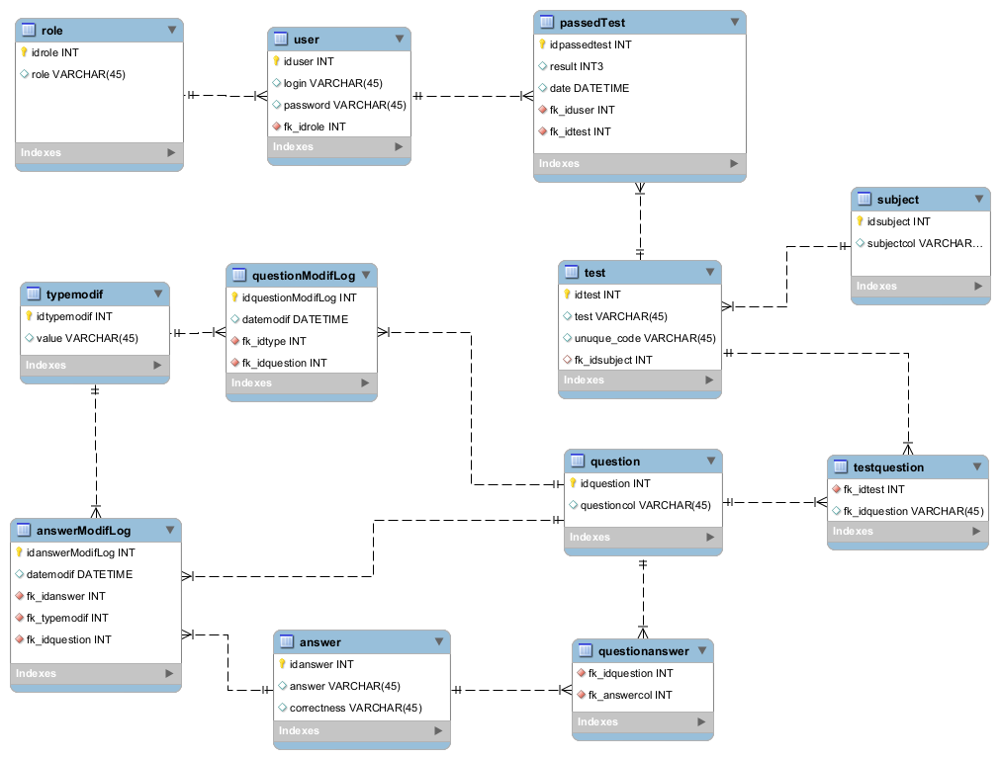

# 진행 자료

# 데이터베이스는 세부사항이다.

## (conclusions)

아키텍처 관점에서 데이터베이스는 엔티티가 아니다. --> 세부사항일 뿐이다.

- 데이터베이스 = 데이터에 접근할 방법만을 제공하는 소프트웨어
- 데이터베이스 = 아키텍처 관점에서는 저수준의 세부사항

## 관계형 데이터베이스
흔히 테이블이 있는 구조를 갖는 DB를 관계형 데이터베이스라고 일컫는다.




- 관계형이든, 분산형이든, 혹은 그 밖의 다른 구조든 결국 데이터의 저장 방식이고 데이터에 접근할 방법에 관한 이야기일 뿐이다.

- 이러한 디테일한 내용을 아키텍처 수준에서 알고 있어야 하나?
  - 그렇지 않다!!! 이러한 방식과 무관하게 작동해야 한다.
- 아키텍처와 DB를 분리하기 위해서는 어떤 것을 할 수 있을까?

  - 데이터 접근 프레임워크에 테이블/행/객체 형태의 무언가를 쓰지 말 것. 이것 자체로 '관계형 데이터베이스'를 기반으로 작동한다는 것을 암시하는 것이고, 또 이것은 아키텍처 레벨에서 세부사항에 의존하는 것임.

## DB 시스템이 왜 이렇게 널리 사용되는가?
- 이 질문에 답하려면 "회전식 디스크"에 관한 역사를 알아야 한다.
- 아래는 회전식 디스크의 구조이다.


- 지금은 매우 더디지만, 역사적으로 디스크는 용량 측면에서 많은 발전을 이뤄왔다.
- 그러나!! 속도는 매우 느렸다. --> (문제점)
- 지금은 어떠한가?
  - 디스크 -> RAM -> 캐시 메모리(L1, L2, L3, ...) -> 레지스터
  - 위와 같은 계층적 구조를 통해 locality를 이용한 속도 개선을 내고 있다.
  - 그리고...
  - 디스크로 인한 시간 지연을 완화하기 위한 다양한 기술들이 도입되었다.
    - 색인, 캐시, 쿼리 계획 최적화(Query Optimization)
    - 접근 및 관리 시스템
      - 파일 시스템: 문서 기반, 이름 기준으로 조회는 매우 쉬움. 그러나, 내용 기준 검색에서는 부진함.
      - 데이터베이스 시스템: 내용 기반. 내용 기반으로 레코드를 검색. 그러나, 정형화된 문서에만 적합.
      - 공통점? 필요한 부분만을 그때그때 RAM으로 적재한다.(밀리초 소요됨.)

## 디스크가 없어진다면?
- 언젠가는 디스크도 없어질 것이다.
- 무엇으로 대체되는가? RAM
- 이 데이터들을 여러 가지 자료구조로 체계화하고, 이것을 포인터나 참조 등으로 접근할 것이다.

**결론** 그저 데이터베이스는 비트를 담는 거대한 그릇이라고 생각하면 편하다. 아키텍처 관점에서는 DB에서 어떤 식으로 데이터를 저장하고 있는지 관심을 가질 필요도 없다. 그냥 DB나 디스크는 없다고 생각해도 될 정도의 아키텍처가 이상적이다. --> 일종의 **layered architecture**

- 그렇다고 데이터가 중요하지 않다는 것은 절대 아니다.
- 또 위처럼 한다고 성능이 좋아진다는 건 또 다른 이야기이다.

# 웹은 세부사항이다.

## (conclusions)
- Web을 둘러싼 전체적인 구조


## 웹이 바뀌어온 역사

- 웹은 두 가지 방향 사이에서 계속 진동해왔다.("연산 능력을 어디에 둘지에 관한 것")
  - 모든 연산을 중앙 서버에 두는 방식 ... A
  - 모든 연산을 각각 단말에 두는 방식 ... B
- HISTORY...
  - 모든 연산을 서버 팜(Server Farm)에 밀어 넣었다. (A)
  - 브라우저에 애플릿을 추가하기 시작했다. (B)
  - 동적인 내용은 다시 서버로 이동시켰다. (A)
  - 웹 2.0을 고안했고, AJAX와 자바스크립트를 이용해서 많은 부분을 브라우저로 옮겼다. (B)
    - 현재는 거대한 애플리케이션 전부를 브라우저에서 실행하는 수준까지 왔다.
    - AJAX? Asynchronous JavaScript And XML
  - 지금은 또 Node.js를 이용해 JS를 다시 서버로 이동시키는 과정을 걷고 있다. (A)

**결론** 아키텍처의 관점에서는 이 또한 멀리 내다보아야 한다. 웹이 아무리 위와 같이 계속 진동하며 변했더라도 웹 자체는 아무것도 바뀌지 않았다.


# 프레임워크는 세부사항이다.

## (conclusions)

**프레임워크**: 어떠한 목적을 달성하기 위해 복잡하게 얽혀있는 문제를 해결하기 위한 구조며, 소프트웨어 개발에 있어 하나의 뼈대 역할을 한다.

프레임워크는 근래에 큰 인기를 끌고 있으며, 무료이고, 강력하고, 유용한 것이 많다.


## 프레임워크 제작자의 입장에서 보는 프레임워크
- 프레임워크 제작자 본인이 해결해야 할 문제를 알고 있다.
- 그 문제에 대한 해결책을 프레임워크로 만들어 무료로 배포한다.
- 그러나, 내가 풀 문제를 해결하고자 만들어진 것은 아니다.
- 물론 내가 풀어야 하는 문제와 그들이 푼 문제는 겹치는 부분이 있을 것이다.
- 이 겹치는 영역이 클수록 프레임워크의 유용성은 커진다.


## 혼인 관계의 비대칭성
- '나'와 프레임워크 제작자 사이의 비대칭성
  - 나는 프레임워크를 위해 대단히 큰 헌신을 해야한다.
  - 프레임워크 제작자는 나를 위해 아무런 헌신도 하지 않는다.
  - 일방적인 혼인관계
    - 나의 입장
      - 프레임워크 제작자가 제공한 문서를 꼼꼼히 읽는다. --> 통합에 대한 조언
        - 주로 제작자가 만든 프레임워크를 중앙에 두고
        - 우리의 아키텍처는 그 바깥을 감싸는 구조로 만들 것을 이야기한다.
        - 프레임워크 클래스에서 직접 파생(derived class)
        - 프레임워크 기능들을 import
      - &rarr; 나의 애플리케이션이 프레임워크와 공고하게 결합되게 만든다.

    - 프레임워크 제작자의 입장
      - 프레임워크에 대한 절대적인 제어권을 쥐고 있다.
      - '나'도 이 프레임워크에 종속되기를 바란다.
      - 한번 결합되면 애플리케이션과 프레임워크가 다시는 분리될 수 없는 방식이 되게끔
        - &rarr; 사용자가 점점 많아진다.
        - &rarr; 자신들의 프레임워크가 효과적임을 검증하는 셈이 된다.

- 결론: **모든 위험과 부담은 나의 몫이며, 제작자가 감수하는 것은 아무것도 없다.**

## 우리가 고려해야 할 위험 요인
- 프레임워크에 한번 종속되면 빠져나가기가 어렵다.
  - 프레임워크의 아키텍쳐가 깔끔하지 않은 경우
  - 의존성 규칙을 위반하는 경우
    - 나만의 고유한 엔티티를 만드려고 하는데 이들은 자신의 코드를 상속하기를 원한다.
    - 그러나, 이 프레임워크가 한번 쓰이면 다시 빼기가 어렵다.

- 초기기능을 구현하는 데에는 도움이 되지만, 시간이 지나면서 프레임워크가 제공하는 기능과 틀을 벗어나게 될 것이다.
  - 시간이 지나면 이러한 프레임워크와 씨름을 해야한다.

- 프레임워크가 나에게 도움되지 않는 방향으로 진화할수도 있다.
  - 도움되지 않는 신규 버전으로 업그레이드하느라 다른 일을 못한다거나
  - 사용중인 기능이 사라진다거나(?)
  - 반영하기 힘든 형태로 변경되거나

- 새로운, 더 나은 프레임워크의 등장


## 그렇다면 해결책은?
> "프레임워크와 결혼하지 말라!"

- 프레임워크를 사용을 하되, 이들과 결합하지 않고 거리를 둔다.
  - 프레임워크 = 아키텍처의 바깥쪽 원에 속하는 세부사항
  - 절대 원에 들어오지 못하도록!

- 프레임워크의 기반 클래스(base class)로부터 파생하기를 원한다면?
  - 거절한다!

  - 

  - 프록시(Proxy)를 만들고, 업무 규칙에 플러그인 할 수 있는 컴포넌트에 이들을 위치시킨다.
  (maybe.. in design pattern?)

  - 프레임워크가 핵심 코드에 들어오지 못하게 한다.
    - 핵심 코드에 플러그인할 수 있는 컴포넌트에 프레임워크를 통합시킨다.
    - 의존성 규칙 준수

  - example
    - Spring = 훌륭한 의존성 주입 프레임워크
      - 의존성 연결 --> 오토 와이러링(auto-wiring)?
      - @autowired 어노테이션을 남발해서는 안된다.
      - 업무 객체는 절대 스프링에 대해 알아서는 안된다.

**결론**

프레임워크를 쓰지 말라는 것은 아니다. 오히려 C++을 쓴다면 STL을, Java를 쓴다면 표준 라이브러리를 반드시 써야하는 경우가 생긴다.

그럼에도, 프레임워크의 사용은 선택적이어야 한다. 프레임워크를 사용하면 이 관계는 지속적이다. 결코 가볍게 시작할 수 있는 관계는 아님.

가급적이면 프레임워크를 가능한 한 오랫동안 아키텍처 경계 너머에 두자.(책 문장 그대로 끌어옴)


---

# 질의응답

```text
지인:

대답: (PR에서 suggest로 커밋하기 편하게 질문 작성 후 이 구문은 지워주세요 ㅎㅎ)
```

```text
하진:

대답: (PR에서 suggest로 커밋하기 편하게 질문 작성 후 이 구문은 지워주세요 ㅎㅎ)
```

```text
진영:

대답: (PR에서 suggest로 커밋하기 편하게 질문 작성 후 이 구문은 지워주세요 ㅎㅎ)
```

```text
규훤:

대답: (PR에서 suggest로 커밋하기 편하게 질문 작성 후 이 구문은 지워주세요 ㅎㅎ)
```

```text
진호:

대답: (PR에서 suggest로 커밋하기 편하게 질문 작성 후 이 구문은 지워주세요 ㅎㅎ)
```

```text
천규:

대답: (PR에서 suggest로 커밋하기 편하게 질문 작성 후 이 구문은 지워주세요 ㅎㅎ)
```

```text
준우:

대답: (PR에서 suggest로 커밋하기 편하게 질문 작성 후 이 구문은 지워주세요 ㅎㅎ)
```

```text
이영:

대답: (PR에서 suggest로 커밋하기 편하게 질문 작성 후 이 구문은 지워주세요 ㅎㅎ)
```

```text
영재:

대답: (PR에서 suggest로 커밋하기 편하게 질문 작성 후 이 구문은 지워주세요 ㅎㅎ)
```

```text
태훈:

대답: (PR에서 suggest로 커밋하기 편하게 질문 작성 후 이 구문은 지워주세요 ㅎㅎ)
```
